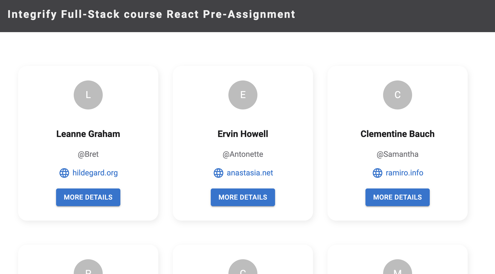
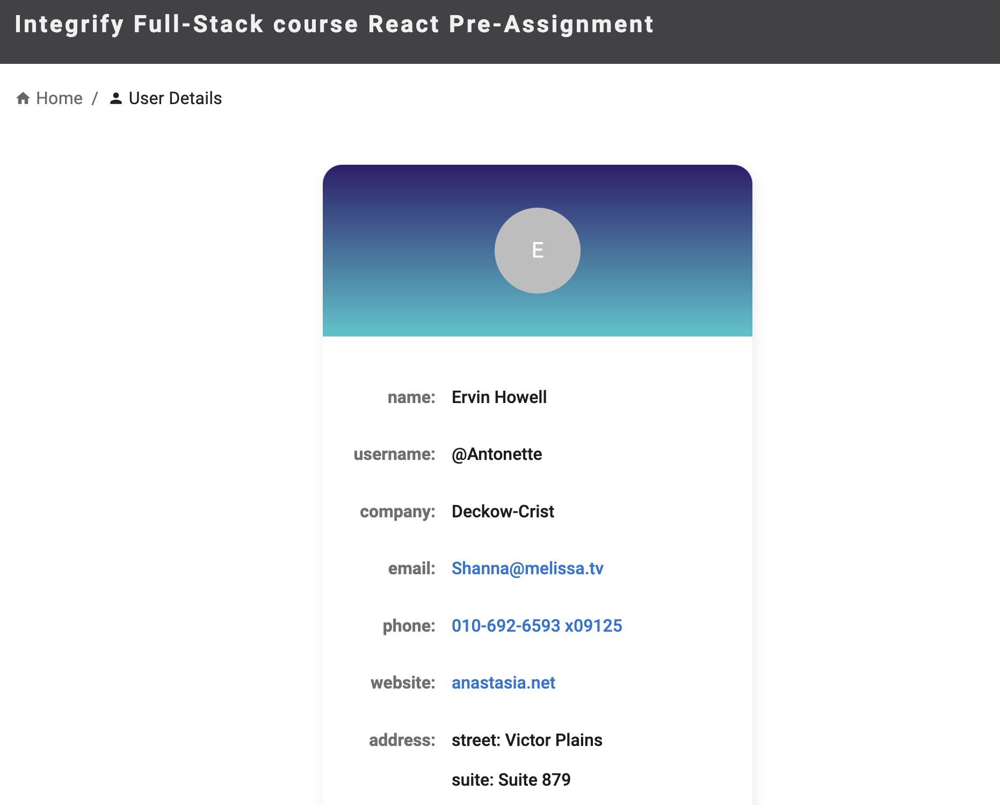

# Integrify Assignment 2022

This is an assignment for FullStack program at Integrify.

Latest version is deployed at https://infallible-benz-8250cf.netlify.app/

### Requirements:

- Create a home page which shows cards containing information about users
- Divide the app into smaller components
- When clicking the button on a card the app should navigate to another page (component) showing detailed information about the user

### My implementation details

- Uses functional components
- Uses `useState`, `useEffect`, `useParams` hooks
- Material UI for styling
- SCSS

### Screenshots

*Home page:*



*User details:*



### Running the project

#### Option 1

Prerequsites:
- Node.js >= 16.13

Navigate to the project folder and install dependencies by running:
```
$ npm install
```

Start the app by running:
```
$ npm start
```

#### Option 2 (Docker)

Prerequisites:
- Docker

Navigate to the project folder and build the image, e.g.:
```
$ docker build -t aerokhina-integrify .
```

Run the image, e.g.:
```
$ docker run -it --rm -p 3000:3000 aerokhina-integrify
```

Navigate to http://localhost:3000/ in your browser.
